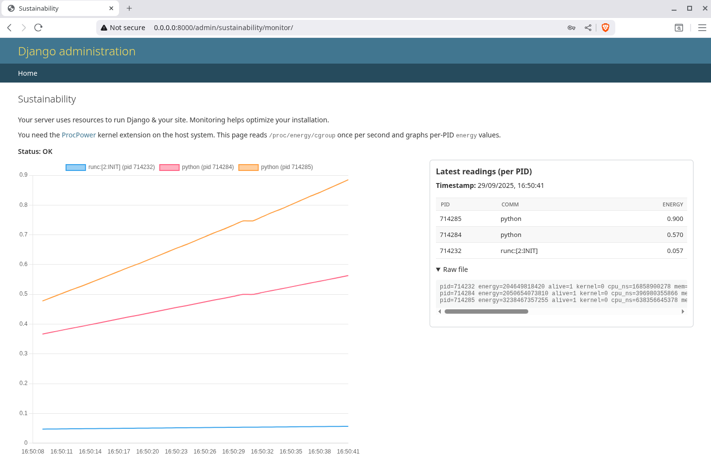

# Django Sustainability Monitor

A Django admin extension that visualizes the energy consumption of your Django application in real time.
It reads data from the [`procpower`](https://github.com/green-kernel/procpower) kernel extension (`/proc/energy/cgroup`) and displays it in a live chart (1-second interval) directly inside the Django admin interface.

<p align="center">
  
</p>

## ✨ Features

- Adds a **Sustainability** page in the Django admin area
- Reads energy usage per PID from `/proc/energy/cgroup` (via `procpower`)
- Displays a real-time line chart using [Chart.js](https://www.chartjs.org/)
- Shows tabular readings sorted by current energy use
- Includes raw `/proc/energy/cgroup` output for debugging
- Keeps data fully inside the Docker container — **no sensitive host data is leaked**

## ⚡ Requirements

- Linux host with [`procpower`](https://github.com/green-kernel/procpower) installed and `/proc/energy/cgroup` available
- Docker & Docker Compose
- Django (tested with Django ≥ 4.2, but should work with 3.2+)

## 🔎 Limitations

Due to the way Linux and Docker work, we can only show the energy usage of the container the Django app is running in.
It is technically not possible to display the resource consumption of other processes.

If you are running your database in another container or on a separate host, you will need to install a logger inside this container. This is straightforward, as you can simply read the `cgroup` file available within the container.

## 🚀 Quick Start (Docker Compose)

Clone this repository and run Django with the sustainability monitor:

```bash
git clone https://github.com/your-org/django-sustainability-monitor.git
cd django-sustainability-monitor

docker compose up
```

Then you can access the demo under [http://localhost:8000/admin/sustainability/monitor/](http://localhost:8000/admin/sustainability/monitor/)
